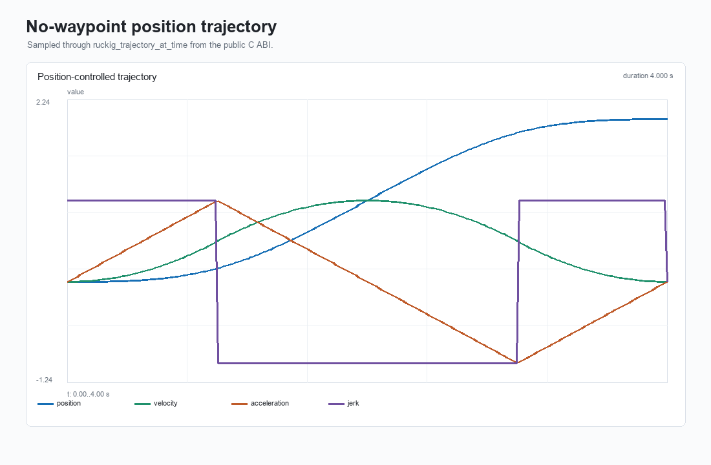
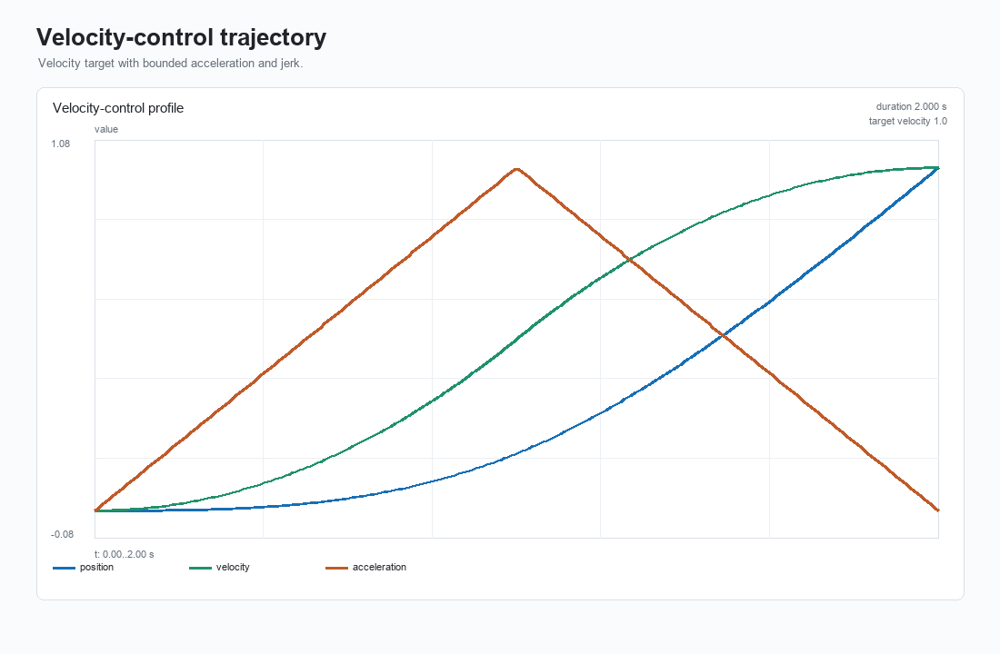
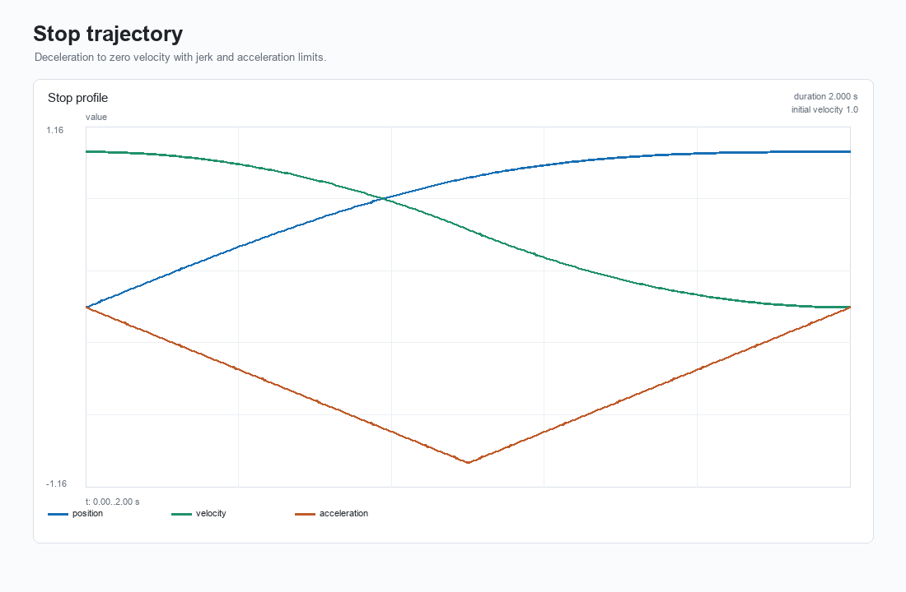
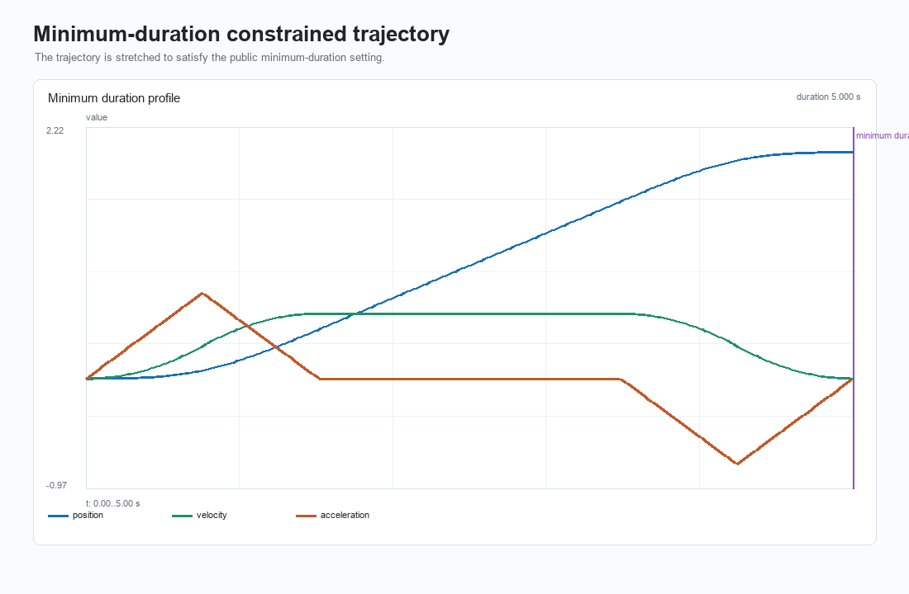
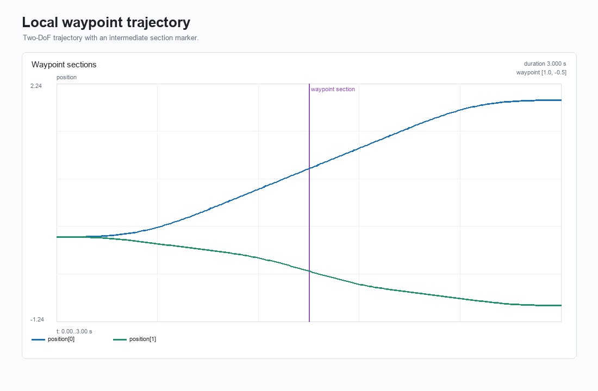
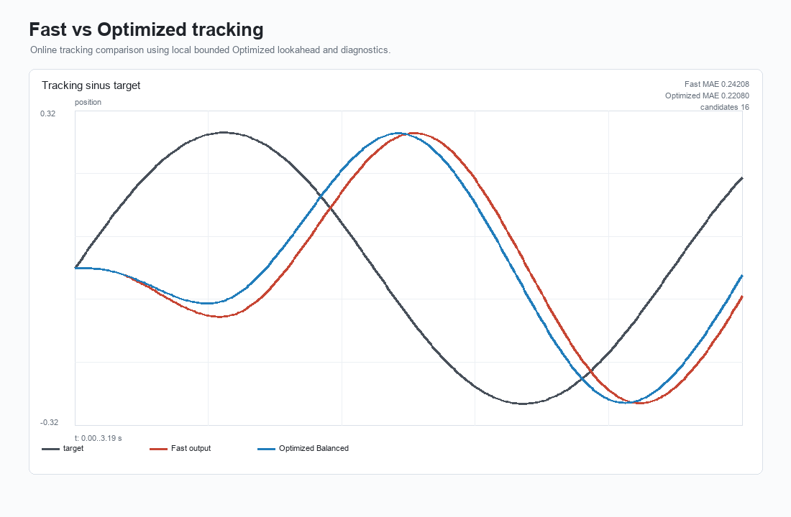

# Algorithm Visualization

This document records the `0.8.0-design` local visualization evidence. The
gallery is generated from `ruckig_c` public C ABI data through the Python
`cffi` prototype; it does not copy original Ruckig images as primary project
evidence.

## Status

`0.8.0-alpha` adds a local deterministic gallery generator:

```powershell
cmake --build --preset windows-clang-ninja-shared
$env:RUCKIG_C_SHARED_LIBRARY=(Resolve-Path out\build\windows-clang-ninja-shared\ruckig_c.dll).Path
python tools\visualization\generate_gallery.py --output docs\assets\visualization
```

The generator writes PNG assets and a manifest:

- `docs/assets/visualization/no_waypoint_position.png`
- `docs/assets/visualization/velocity_control.png`
- `docs/assets/visualization/stop_trajectory.png`
- `docs/assets/visualization/minimum_duration.png`
- `docs/assets/visualization/waypoint_sections.png`
- `docs/assets/visualization/tracking_fast_vs_optimized.png`
- `docs/assets/visualization/manifest.json`

## Gallery













## Evidence Boundaries

- The images are generated from local `ruckig_c` data through the public C ABI.
- Original Ruckig `doc/*.png`, `examples/*_trajectory.pdf`, and
  `examples/plotter.py` remain references only; they are not copied as
  primary evidence.
- The gallery is documentation/evidence work, not solver behavior work.
- The generator is local-only and is not a default GitHub Actions gate.
- Pillow is the only rendering dependency used by the local tool. NumPy and
  Matplotlib are not required.
- Python `cffi` remains a prototype path used to drive the C ABI; this does
  not publish or stabilize a Python package.
- No public C API, public symbol, enum value, result code, or ABI artifact path
  changes are introduced by this visualization work.
- No cloud, Pro license, network image fetching, or formal Pro/cloud
  equivalence claim is used.

## Follow-Up

Future visualization work can add more scenarios, SVG/PDF export, richer
waypoint section diagnostics, or optional CI artifact generation. Those remain
separate scope decisions because they affect dependency policy and artifact
volume.
